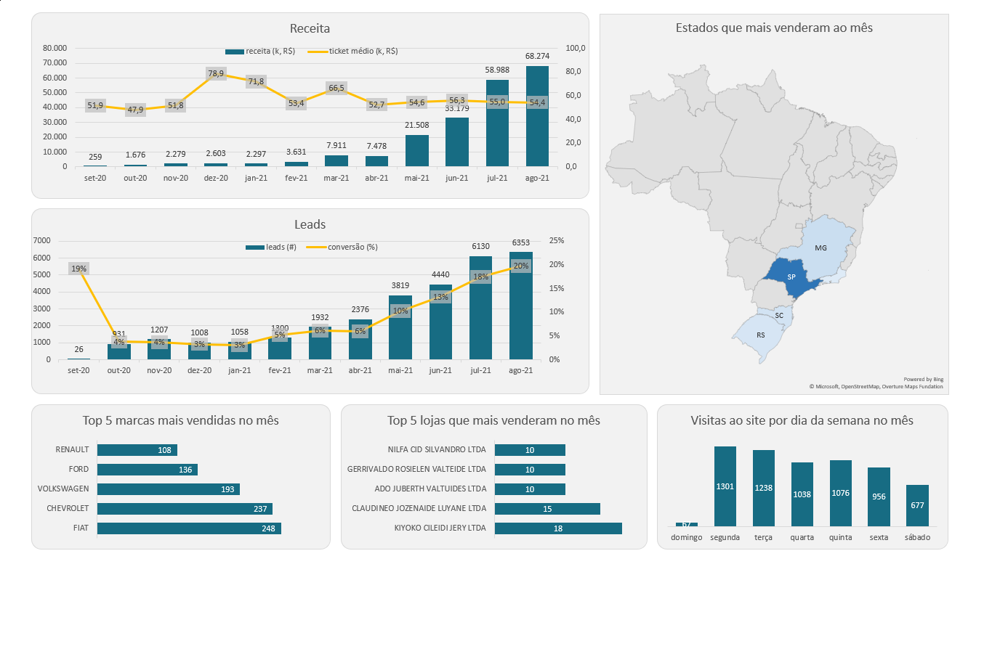
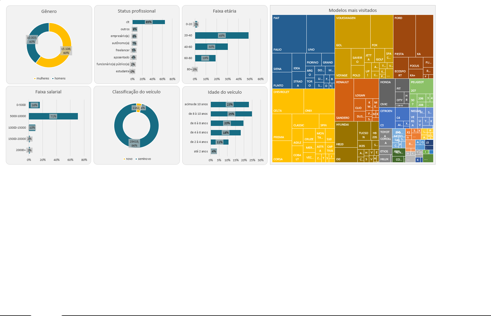

# Projeto SQL para Análise de Dados

Este projeto é um estudo prático baseado no curso **SQL para Análise de Dados**, disponível na Udemy. O objetivo é aplicar os conceitos e técnicas de SQL para manipulação e análise de dados, criando consultas otimizadas e gerando insights relevantes para a tomada de decisão.

---

## Conteúdo do Projeto

- Introdução ao SQL e seus principais comandos
- Filtragem e ordenação de dados
- Uso de funções agregadas (SUM, AVG, COUNT, etc.)
- Junções entre tabelas (INNER JOIN, LEFT JOIN, RIGHT JOIN)
- Subconsultas e CTEs (Common Table Expressions)
- Agrupamentos e análises avançadas
- Construção de dashboards simples para visualização dos resultados

---

## Tecnologias Utilizadas

- **PostgreSQL** (gerenciado via **pgAdmin**)
- **Microsoft Excel** (para criação de dashboards e visualizações)

---

## Como Executar

1. Clone este repositório:
   ```bash
   git clone https://github.com/Kethyoliver/SQL---b-sico-ao-Avan-ado.git

## Imagens do Dashboard




## Sobre o Curso

Este projeto foi inspirado no curso SQL para Análise de Dados, que oferece uma base sólida para quem deseja aprender SQL e aplicar em projetos reais de análise de dados.
